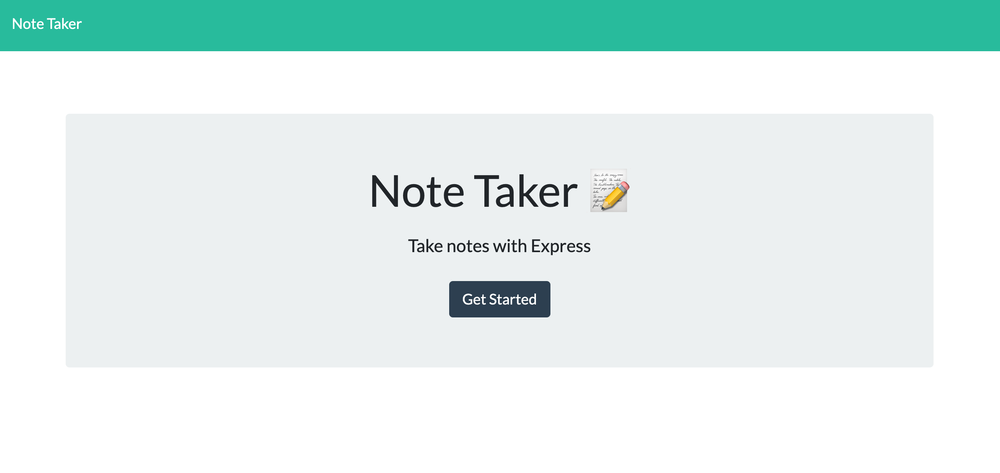
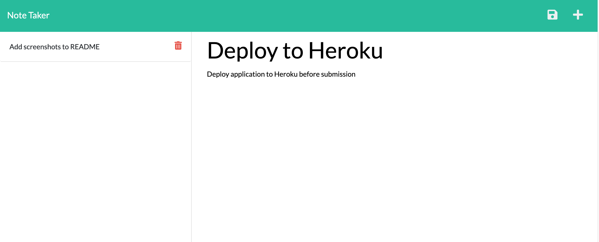

# Note-Taker

https://infinite-shelf-70708.herokuapp.com/

## Description
  
Note Taker can be used to write and save notes. It uses an Express.js back end and saves and retreives note data from a JSON file. 

## Usage

Launch the application and select "Get Started".

Add a new note and view saved notes.

